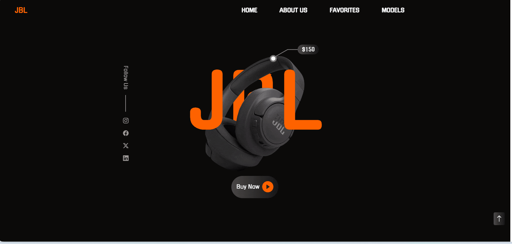

<h1>JBL-Clone-Project</h1>

The JBL website is designed to promote its products and provide customer service. The site allows users to obtain detailed information about JBL products, follow new product launches and receive technical support.
 
<h2>Technologies used in the project</h2>

Codded in HTML5, CSS3 and SCSS

<h2>Screen Gif</h2>

